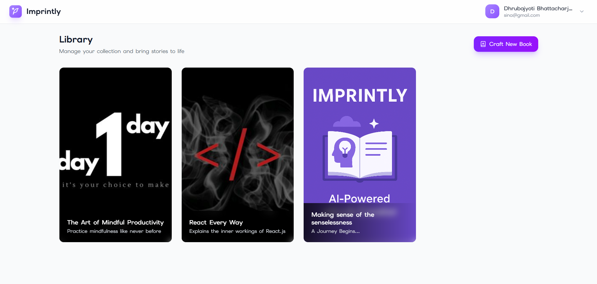
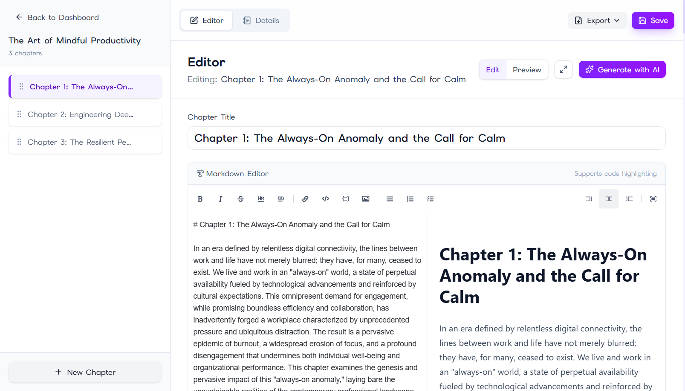
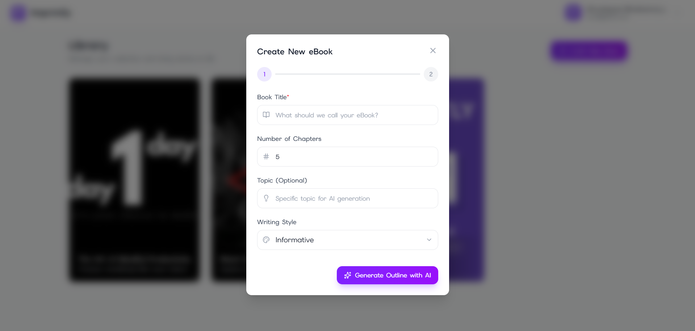

# Imprintly 📚✨

> **Transform your ideas into professional eBooks in minutes with AI-powered assistance.**

Imprintly is a full-stack MERN application that revolutionizes the eBook creation process. With intelligent AI assistance, beautiful design tools, and seamless export options, bringing your stories to life has never been easier.

[](https://imprintly.onrender.com)
[](LICENSE)
[](https://github.com/KeepSerene)

---

## 🌟 Features

### ✍️ Smart Writing Experience

- **AI-Powered Content Generation**: Generate book outlines and chapter content using Google's Gemini AI
- **Rich Text Editor**: Markdown-based editor with real-time preview and syntax highlighting
- **Drag & Drop Organization**: Reorder chapters effortlessly with intuitive drag-and-drop interface

### 🎨 Professional Design

- **Custom Cover Images**: Upload and manage beautiful book covers (JPEG, PNG, GIF, WebP)
- **Chapter Management**: Organize chapters with titles, descriptions, and rich content
- **Responsive Interface**: Beautiful UI that works seamlessly across all devices

### 📤 Flexible Export Options

- **PDF Export**: Download your eBook as a professionally formatted PDF
- **DOCX Export**: Export to Microsoft Word format for further editing
- **Instant Downloads**: One-click export with proper formatting and styling

### 🔐 Secure & Personal

- **User Authentication**: JWT-based secure authentication system
- **Personal Library**: Manage multiple books in your private dashboard
- **Profile Management**: Customize your author profile and preferences

### 🚀 Performance Optimized

- **Fast Loading**: Optimized build with Vite and modern React
- **Efficient API**: RESTful API with proper error handling and validation
- **Scalable Architecture**: MongoDB for reliable data persistence

---

## 🛠️ Tech Stack

### Frontend


- **React 19.2** - Latest React with concurrent features
- **React Router 7.9** - Client-side routing
- **Tailwind CSS 4.1** - Utility-first CSS framework
- **Lucide React** - Beautiful icon library
- **React Markdown Editor** - Rich markdown editing experience
- **DnD Kit** - Smooth drag-and-drop interactions
- **React Hot Toast** - Elegant notifications
- **Axios** - HTTP client with interceptors

### Backend


- **Node.js & Express** - Server runtime and framework
- **MongoDB & Mongoose** - NoSQL database with ODM
- **JWT Authentication** - Secure token-based auth
- **Multer** - File upload handling
- **BCrypt** - Password hashing
- **Google Gemini AI** - AI content generation
- **Docx & PDFKit** - Document generation libraries

### DevOps & Tools

- **pnpm** - Fast, disk space efficient package manager
- **Render** - Cloud hosting platform
- **Git & GitHub** - Version control

---

## 📸 Screenshots

### Landing Page


_Beautiful, modern landing page with gradient designs and smooth animations_

### Dashboard


_Manage all your books in one place with an intuitive card-based layout_

### Book Editor


_Rich markdown editor with live preview and AI-powered content generation_

### AI Content Generation


_Generate book outlines and chapter content with AI assistance_

---

## 🚀 Getting Started

### Prerequisites

- Node.js (v18 or higher)
- MongoDB (local or Atlas)
- pnpm (v9 or higher)
- Google Gemini API key

### Installation


1. **Install dependencies**

```bash
# Install backend dependencies
cd backend
pnpm install

# Install frontend dependencies
cd ../frontend
pnpm install
```

2. **Set up environment variables**

Backend (.env in `/backend`):

```env
NODE_ENV=development
PORT=3000
DB_URI=your_mongodb_connection_string
JWT_SECRET_KEY=your_super_secret_jwt_key
GEMINI_API_KEY=your_gemini_api_key
CLIENT_URL=http://localhost:5173
```

Frontend (.env in `/frontend`):

```env
VITE_API_BASE_URL=http://localhost:3000
```

3. **Run the application**

```bash
# Terminal 1 - Run backend
cd backend
pnpm run dev

# Terminal 2 - Run frontend
cd frontend
pnpm run dev
```

4. **Open your browser**
   Navigate to `http://localhost:5173`

---

## 📁 Project Structure (Tentative!)

```
imprintly/
├── backend/
│   ├── src/
│   │   ├── configs/         # Configuration files
│   │   ├── controllers/     # Route controllers
│   │   ├── middlewares/     # Custom middlewares
│   │   ├── models/          # Mongoose models
│   │   ├── routes/          # API routes
│   │   ├── utils/           # Utility functions
│   │   └── server.js        # Express app entry
│   └── package.json
├── frontend/
│   ├── public/              # Static assets
│   ├── src/
│   │   ├── components/      # React components
│   │   ├── contexts/        # React contexts
│   │   ├── pages/           # Page components
│   │   ├── routes/          # Routing config
│   │   ├── utils/           # Utilities
│   │   └── main.jsx         # App entry point
│   └── package.json
└── package.json             # Root package file
```

---

## 🔑 API Endpoints

### Authentication

- `POST /api/auth/register` - Register new user
- `POST /api/auth/login` - User login

### Profile

- `GET /api/profile` - Get user profile
- `PUT /api/profile` - Update user profile
- `PUT /api/profile/avatar` - Update user avatar
- `DELETE /api/profile/avatar` - Delete user avatar

### Books

- `GET /api/books` - Get all user books
- `POST /api/books` - Create new book
- `GET /api/books/:bookId` - Get specific book
- `PUT /api/books/:bookId` - Update book content
- `PUT /api/books/:bookId/cover` - Update book cover
- `DELETE /api/books/:bookId` - Delete book

### AI Generation

- `POST /api/ai/generate-book-outline` - Generate book outline
- `POST /api/ai/generate-chapter-content` - Generate chapter content

### Exports

- `GET /api/exports/:bookId/pdf` - Export as PDF
- `GET /api/exports/:bookId/docx` - Export as DOCX

---

## 🌐 Deployment

This project is configured for deployment on [Render.com](https://render.com/). The build process automatically:

1. Installs all dependencies using pnpm
2. Builds the React frontend
3. Serves the frontend from the Express backend in production
4. Handles all routing through React Router


---

## 📝 License

This project is licensed under the Apache License 2.0 - see the [LICENSE](LICENSE) file for details.


